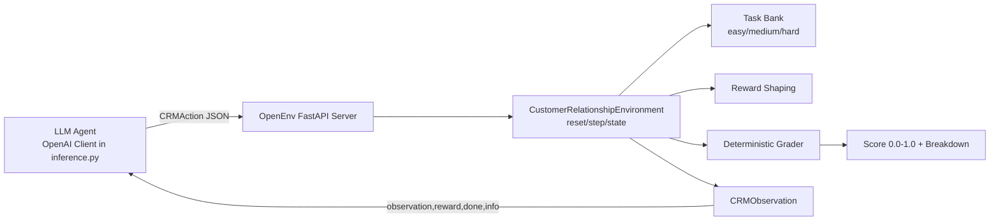
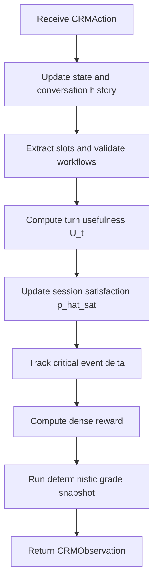

---
title: Customer Relationship VRM Environment
emoji: 🤝
colorFrom: blue
colorTo: green
sdk: docker
app_port: 7860
tags:
  - openenv
pinned: false
---

# Customer Relationship Management (VRM) Environment

This OpenEnv environment simulates real fintech customer-relationship operations to improve customer satisfaction and NPS outcomes under operational/compliance constraints.

## Real-world scope

Tasks mirror actual support workflows :
- card fraud containment,
- fee dispute + retention,
- SMB payment-failure churn prevention.

## Agent architecture

This project evaluates an external LLM agent (from `inference.py`) against a deterministic CRM environment.

### High-level architecture



### Internal environment pipeline (per step)



### Components

- `inference.py`: baseline agent runner using OpenAI client.
- `server/customer_relationship_environment.py`: core environment dynamics and reward logic.
- `server/task_bank.py`: task definitions and difficulty progression.
- `server/graders.py`: deterministic score model and metric formulas.
- `models.py`: typed action/observation and event taxonomy models.

## Action space

`CRMAction`:
- `action_type`: `analyze|respond|workflow|finalize|handoff`
- `intent`, `response_text`, `workflow`, `extracted_slots`, `confidence`, `rationale`
- `event_type`: critical-point taxonomy
  - `clarifying_q`, `suggestion`, `confirmation`, `handoff`, `escalation_trigger`,
  - `repair_moment`, `tool_failure`, `auth_checkpoint`, `compliance_disclosure`
- `tool_status`: `ok|failed|timeout`

## Observation space

`CRMObservation` exposes:
- task spec (`task_id`, difficulty, objective, max steps)
- slot state, workflow trace, risk/outstanding requirements
- `account_context`: full customer profile (tier, LTV, NPS, tenure, risk flags)
- `compliance_policies`: regulatory policies the agent must follow (e.g. Reg E, NACHA, retention guardrails)
- `prior_interactions`: recent support history with satisfaction ratings
- `knowledge_base`: relevant articles the agent can reference
- `turn_usefulness` rubric + normalized score
- `session_satisfaction_hat` (calibrated satisfaction probability)
- `critical_event_impacts` (per-event average delta in satisfaction)
- deterministic `grade` breakdown in metadata with final score `[0,1]`

## Tasks and deterministic graders

1. `easy_card_freeze` (easy)
2. `medium_dispute_retention` (medium)
3. `hard_business_churn_prevention` (hard)

Grader in `server/graders.py` returns deterministic score in `[0.0, 1.0]`.

Grade components and weights:
- **intent** (14%): correct intent classification
- **slots** (20%): required slot collection
- **workflow** (19%): required/optional workflow completion
- **satisfaction_hat** (14%): session satisfaction proxy
- **usefulness** (8%): average turn usefulness
- **efficiency** (6%): step count and tool failure penalties
- **compliance** (12%): regulatory disclosures, auth checkpoints, policy coverage (boosted for high-risk tasks)

## Scoring formulas aligned to your framework

### Turn-level usefulness

The environment uses weighted normalized usefulness:

`U_t = 100 * (w_c*C + w_cp*P + w_cl*L + w_a*A + w_s*S) / (2*(w_c+w_cp+w_cl+w_a+w_s))`

Where each dimension is in `[0,2]`:
- `C`: correctness
- `P`: completeness
- `L`: clarity
- `A`: actionability
- `S`: safety/compliance

Default weights emphasize correctness/safety:
- `w_c=2, w_cp=1, w_cl=1, w_a=1, w_s=2`

### Session-level satisfaction proxy

`p_hat_sat = sigma(beta0 + beta1*TaskSuccess + beta2*avg(U) - beta3*Cost - beta4*ToolFailures - beta5*RepairLoops - beta6*HandoffPenalty)`

This is implemented in `CRMTaskGrader.session_satisfaction_hat()`.

### Critical-point impact score

For each event type `e`:

`Delta_e = E[p_hat_sat_post - p_hat_sat_pre | event=e]`

This is tracked online as `critical_event_impacts`.

## Reward shaping

Dense reward combines:
- partial progress: intent, slots, required workflows
- compliance signals: disclosures (+0.04), auth checkpoints (+0.03), policy keyword mentions (+0.05)
- usefulness uplift and satisfaction proxy impact
- penalties: handoff misuse, tool failure, loops/max-step, high-risk unverified flow
- terminal adjustment with deterministic grader score

## How the agent works

The baseline loop in `inference.py` is:

1. `POST /reset` with `task_id`.
2. Read observation (required slots, workflows done, risks, current score proxy).
3. Prompt model to emit a structured `CRMAction`.
4. `POST /step` with that action.
5. Repeat until `done=true` or `MAX_STEPS` reached.
6. Collect final deterministic grade from `observation.metadata.grade.score`.

This produces reproducible per-task trajectory scores.

## Evaluation protocol notes encoded

Metadata includes notes for:
- offline splits: `time_based`, `customer_disjoint`
- key metrics: Spearman, MAE, Quadratic Weighted Kappa, ROC-AUC, PR-AUC, calibration error
- OEC-style multi-metric guardrailed online evaluation

## Setup

```bash
cd rlenv
python -m venv .venv
source .venv/bin/activate
pip install -e .
uvicorn server.app:app --host 0.0.0.0 --port 7860
```

Health check:

```bash
curl http://localhost:7860/health
```

## Docker

```bash
docker build -t customer-relationship-env:latest .
docker run --rm -p 7860:7860 customer-relationship-env:latest
```

## Hugging Face Spaces deploy

1. Create Docker Space
2. Push this folder contents
3. Keep `sdk: docker` and `tags: [openenv]`
4. Set secrets for inference: `API_BASE_URL`, `MODEL_NAME`, `HF_TOKEN`

## Baseline inference (`inference.py`)

- Uses OpenAI client (as required)
- Reads `API_BASE_URL`, `MODEL_NAME`, `HF_TOKEN` (`OPENAI_API_KEY` fallback)
- Runs multiple trajectories per task for reproducible averages
- Prints per-trajectory, per-task means, and overall mean score

Run it:

```bash
export API_BASE_URL="https://router.huggingface.co/v1"
export MODEL_NAME="your-model-id"
export HF_TOKEN="your-token"
export ENV_BASE_URL="http://localhost:7860"
python inference.py
```

## Quick execution checklist

1. Start server (`uvicorn server.app:app ...`).
2. Confirm `/health` returns `200`.
3. Set `API_BASE_URL`, `MODEL_NAME`, `HF_TOKEN`.
4. Run `python inference.py`.
5. Check printed:
   - each trajectory score,
   - each task mean,
   - overall mean score.
